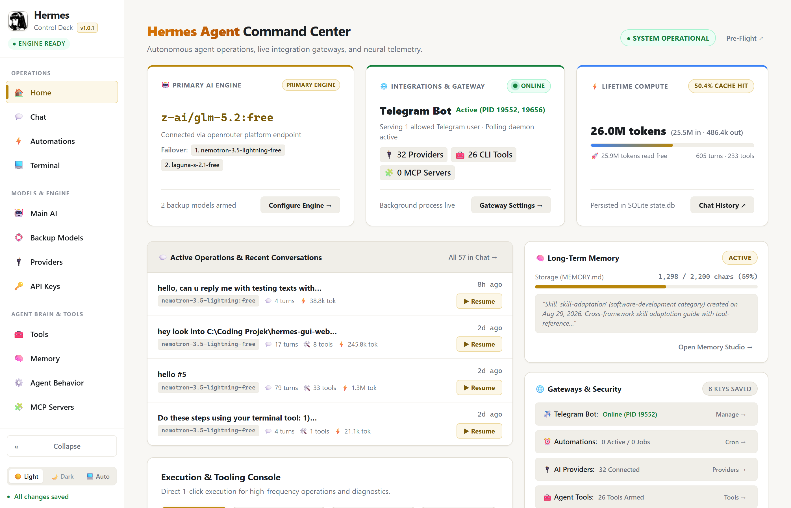
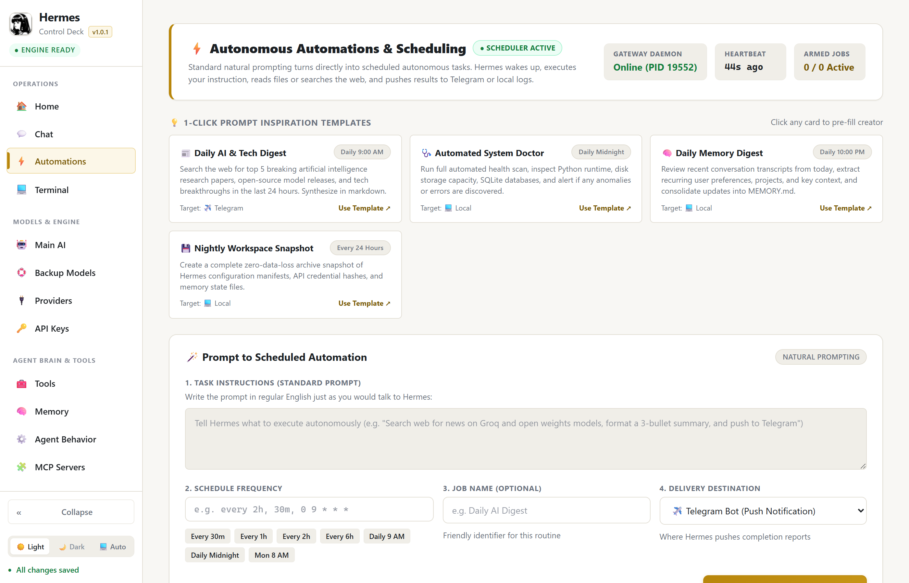
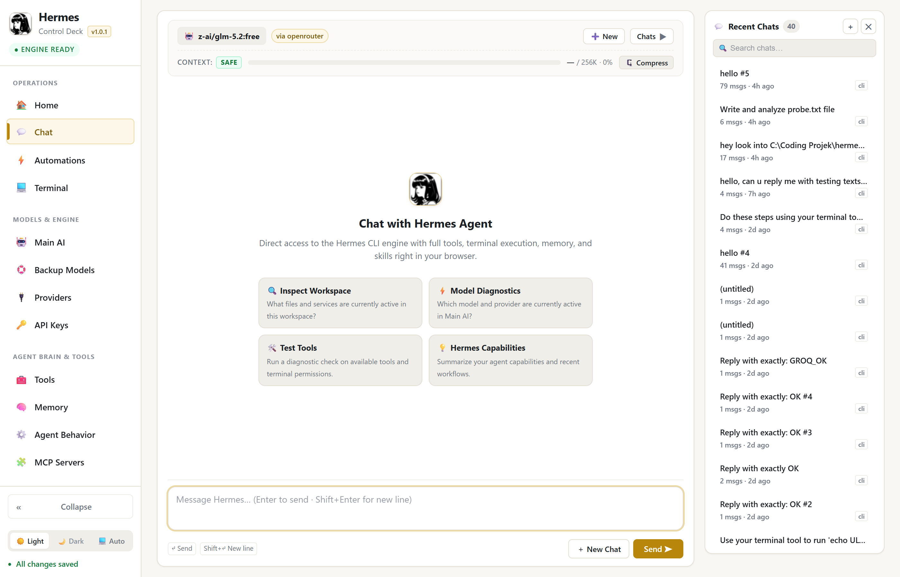

# Hermes Settings GUI — Control Deck

[](https://github.com/sufi96/hermes-settings-gui)
[](https://www.python.org/)
[](LICENSE)
[]()

A modern, local web interface, command center, and interactive dashboard for [Nous Research's Hermes Agent](https://github.com/NousResearch/hermes-agent). Configure models, API credentials, custom provider endpoints, fallback chains, long-term memory, prompt-driven scheduled automations, and execute live agent sessions directly in your browser.

---

## 📸 Screenshots

### 🏠 Mission Control Command Center


### ⚡ Automations & Prompt-Driven Scheduler (New in v1.0.1)


### 💬 Interactive Chat Studio


---

## ✨ What's New in v1.0.2

### 🎒 Skills Library
- **Dedicated Skills Page:** New sidebar tab under *Agent Brain & Tools* listing every installed skill playbook, grouped by category with live search across names and descriptions.
- **Real Load Status:** Backed by `hermes skills list`, so the page reports what actually loads on **this** machine — platform-gated skills (the macOS-only `apple` set on Windows, for example) are counted separately as *On disk* rather than silently inflating the total.
- **Rich Metadata:** Descriptions and versions are read from each `SKILL.md` frontmatter, which the CLI never prints. Category filter, source/status badges, and a refresh control that busts the server-side cache.
- **Fixed Dashboard Count:** The home *Installed Skills* card previously counted the `skills/<category>/` folders and listed those as if they were skills (showing "12 ACTIVE" for 51 real skills). It now shares one cached source with the Skills page, so the two can never disagree — and its shortcut finally lands on Skills instead of the unrelated Tools page.

### 🔄 Reliable Updates & Single Instance
- **One Deck Per Port:** The server now binds exclusively. Windows' `SO_REUSEADDR` previously let a second process bind a port another server was already listening on, so two decks could answer the same address with connections split between them at random — meaning a stale server could serve pages after an update. A duplicate now fails immediately with a clear message instead.
- **No More Orphaned Servers:** A failed in-app update could leave a detached, console-less server holding the port. Both launchers now stop a previous deck before starting, identified by a `.deck-pid` file and verified (alive, is a Python process, running `server.py`) so an unrelated Python program is never touched — a recycled PID is reported and skipped, not killed.
- **Reload Waits For The Server:** The updater polled a fixed 2.2-second timer while the outgoing server exited at 1.2s, leaving the replacement ~1 second to boot. On a slower disk that reload landed on a dead port and the browser showed "This page isn't working". It now polls until the new server actually answers, then reloads — reporting progress, and reloading sooner than the timer did.

### 🧠 Separated Model Reasoning
- **Collapsible Thinking Block:** Assistant replies that carry reasoning now render it in a collapsed `▸ Thinking` panel above the answer instead of running the model's internal monologue straight into the response text.
- **Broader Reasoning Capture:** Chat history reads both the structured `reasoning_content` field and the inline-`<think>` extraction path, so reasoning surfaces whether the provider separates it natively or the agent had to parse it out.

### 🔐 TLS Trust for Model Discovery
- **Fixed `CERTIFICATE_VERIFY_FAILED`:** Windows ships a trimmed root store and fetches missing roots on demand through CryptoAPI — a path OpenSSL never triggers. Providers with perfectly valid public certificates (TokenRouter's GoDaddy chain, for one) failed model discovery with a misleading *"self-signed certificate in certificate chain"*.
- **Unified Trust Store:** All outbound HTTPS now runs through one SSL context that unions the OS store (preserving corporate proxy and custom roots) with certifi's Mozilla bundle. Verification stays fully enabled; `HERMES_GUI_INSECURE_TLS=1` is available as a last-resort escape hatch for genuine TLS-inspecting proxies.

### 🩺 Fixes
- **Main AI "Test Connection":** Always reported failure even against a healthy endpoint. It called `/api/probe/chat`, which returns a different response shape than the handler read, and which ignores the provider name entirely — so registry providers failed before a request was ever made. It now uses the same `/api/probe/provider` path the Engine & Model card already used, gaining proper key resolution through each provider's declared key environment variable.
- **Missing Sidebar Icons on Windows 10:** *Backup Models* rendered as an empty square. Its glyph (`🛟`, Emoji 14.0) is absent from the Segoe UI Emoji font shipped with Windows 10. Replaced, along with two others carrying the same defect (StepFun's provider icon and the Automations creator heading).

---

## 🗄️ Previously in v1.0.1

### ⚡ Autonomous Automations & Scheduling Studio
- **Prompt-Driven Scheduling:** Standard natural language prompting turns directly into scheduled autonomous tasks. Write prompts in plain English—Hermes wakes up, runs the instruction, and pushes results automatically.
- **1-Click Starter Templates:** Pre-configured routines you can arm with a single click:
  - 📰 **Daily AI & Tech Digest** (`0 9 * * *` · Daily at 9:00 AM to Telegram)
  - 🩺 **Automated System Doctor** (`0 0 * * *` · Daily midnight health scan)
  - 🧠 **Daily Memory Synthesis** (`0 22 * * *` · Nightly consolidation into `MEMORY.md`)
  - 💾 **Nightly Workspace Snapshot** (`every 24h` · Zero-data-loss archive)
- **Multi-Channel Delivery:** Deliver completed task reports to **Telegram Bot**, **Local Output/Logs**, or **Bot Chat Sessions**.
- **Daemon Telemetry & Heartbeat:** Real-time tracking of the background scheduler process PID, ticker heartbeat countdown, and armed job counters.
- **Execution Audit History:** Interactive run history drawer querying `executions.db` for execution durations, timestamps, and exit statuses.

### 🧭 Redesigned Mission Control & Categorized Navigation
- **3-Card Executive Hero Deck:** Top-tier visual telemetry for Primary AI Engine (with priority failover breadcrumbs), Live Gateway Matrix (with live Telegram bot PIDs), and Neural Telemetry (with prompt cache savings progress gauge).
- **Categorized Sidebar:** Cleanly organized into 4 logical groups:
  - **Operations:** Home, Chat, Automations, Terminal
  - **Models & Engine:** Main AI, Backup Models, Providers, API Keys
  - **Agent Brain & Tools:** Tools, Memory, Agent Behavior, MCP Servers
  - **Gateways & System:** Telegram Bot, Display & Voice, Advanced
- **Dedicated Memory Studio:** Real-time `MEMORY.md` markdown editor, character capacity gauge, and knowledge card browser.

---

## 🚀 Core Highlights

### 💬 Interactive Chat Studio
- **Full Agent Integration:** Chat directly with Hermes Agent, executing real tools, code environments, and memory storage.
- **Real-Time HUD Stats:** Active model pill, accurate provider attribution tag, working directory chip, reply latency, tool execution counters, and total session duration.
- **Live Context Meter:** Visual token gauge displaying active prompt context against the model limit with `SAFE`, `HIGH USAGE`, and `LIMIT REACHED` indicator states.
- **Context Compression Modal:** Built-in support for Hermes context compaction (`/compact` and `/compress`). Choose between **Standard** (preserves recent ~20 exchanges) and **Aggressive** (keeps only the last 2 exchanges) with optional topic focus and persistent summary storage.
- **Markdown & Code Rendering:** GitHub-style markdown tables, code syntax cards with one-click copy, strikethrough, and collapsible recent chat history drawer.

### 🤖 Model & Provider Configuration
- **Official Providers:** One-click activation and model picker for OpenRouter, DeepSeek, Google Gemini, OpenAI, Groq, Ollama, Anthropic, Mistral, Cerebras, Cohere, and Together AI.
- **Custom Endpoints:** Add, edit, test, and benchmark any local or private OpenAI-compatible endpoint (vLLM, Ollama, LM Studio, LiteLLM, FastChat).
- **Live Catalog & Benchmarking:** Live model catalog discovery, ping testing, and streaming speed measurements (tokens per second).

### 🔑 Credentials & Security Vault
- **Masked Credentials Management:** Inspect, reveal, edit, and delete keys stored in `~/.hermes/.env`.
- **Zero Network Exposure:** The server binds strictly to `127.0.0.1` (localhost). Every request requires a cryptographically random session token (`.deck-token`). Requests without the token receive `401 Unauthorized`.
- **Safe CLI Bridge:** All settings modifications are dispatched through `hermes config` and `hermes tools`. Hermes's native validation rules, type coercion, and automated backups are always preserved.

### 🛠️ Toolsets & System Control
- **Per-Platform Tool Toggling:** Enable or disable toolsets per platform (CLI, Telegram, Discord, etc.) with clean prompt caching preservation.
- **Fallback Chains:** Visual reordering of model fallback chains when primary limits or rate limits are reached.
- **Guardrails & Execution:** Adjust maximum agent turns, memory limits, reasoning effort, terminal timeouts, and tool-loop protection.
- **Backup & Diagnostics:** Run `hermes doctor` checks and create/restore zip backups with one click.

### 🎨 Modern Interface
- **Theme Engine:** Instant switching between Dark, Light, and System modes.
- **Collapsible Sidebar:** Mini sidebar mode (60px) with hover tooltips for maximized workspace area.
- **Mobile Responsive:** Slide-in recent chats drawer and responsive layouts for mobile devices and tablets.

---

## 📂 Directory Structure

```
hermes-settings-gui/
├── server.py              # Lightweight stdlib HTTP server & Hermes CLI bridge
├── static/
│   ├── index.html         # Single-page control deck UI
│   ├── style.css          # Design system, themes, and animations
│   ├── app.js             # Reactive interface & client routing
│   └── hermes_icon.ico    # Application icon
├── assets/
│   ├── screenshot_home.png         # Command Center screenshot
│   ├── screenshot_automations.png  # Automations Studio screenshot
│   ├── screenshot_chat.png         # Chat Studio screenshot
│   ├── hermes_icon.png
│   └── hermes_icon.ico
├── windows/
│   ├── Hermes Settings Windows.bat
│   └── create_shortcut.ps1
├── linux/
│   └── hermes-gui.sh
├── start.bat              # One-click Windows launcher
├── .gitignore
└── README.md
```

---

## 🏁 Getting Started

### Prerequisites
- Python 3.9 or higher.
- [Hermes Agent](https://github.com/NousResearch/hermes-agent) installed (`hermes` command available in PATH or virtual environment).
- `PyYAML` (installed automatically with Hermes).

### Running the Control Deck

#### Windows
Double-click `start.bat` or run:
```bat
start.bat
```

#### Linux / macOS
```bash
python3 server.py
```

The server will perform pre-flight system diagnostics, generate a secure session token, bind to `127.0.0.1:8787`, and automatically open your default browser.

### CLI Options

| Flag | Default | Description |
|---|---|---|
| `--port <PORT>` | `8787` | Port number to bind on localhost |
| `--no-browser` | `False` | Start the server without automatically opening the browser |

Example:
```bash
python server.py --port 9000 --no-browser
```

---

## 💬 Slash Commands in Chat

The chat interface includes native slash command support:

| Command | Action |
|---|---|
| `/compress` | Summarize earlier conversation turns to reclaim context |
| `/compact` | Alias for `/compress` (inspired by Claude Code) |
| `/compress here 2` | Aggressive compaction keeping only the last 2 exchanges |
| `/compress --preview` | Preview token savings without applying changes |
| `/compress <topic>` | Focus summary on a specific topic or task |

---

## 📄 License

Released under the [MIT License](LICENSE).
